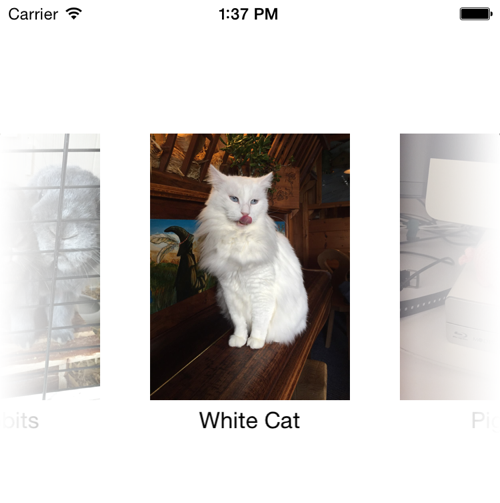

# SwipeImagePicker

SwipeImagePicker is a simple image picker for iOS which supports swipe and has nice gradients. 
It is a UIView which you provide with images, image titles, a rectangle to draw in, and a handler for the users selection.
It is by no means finished or ready-to-use.



## Installation
Simply copy `SwipeImagePickerView.swift` into your project.

## Usage
### Initialization

Initialization is done via the constructor which takes this parameters:
- `frame`: the frame for the SwipeImagePickerView
- `images`: an array of images which are shown in the scrollview
- `titles`: an array of titles which are shown below the images
- `tapHandler`:	the handler which is called when an image is tapped. It's only parameter is the index of the tapped image.

Example:
```
var myImagePickerView = SwipeImagePickerView(
      frame: CGRect(x: 0, y: 100, width: self.view.frame.width, height: 200),
      images: [myGreatImage, myNiceImage, myNotSoNiceImage],
			titles: ["Image 1", "Image 2", "Image 3"]) 
	{ (tappedIndex: Int) in

		var alertView = UIAlertView(title: "Hello", 
		    message: "Tapped image number \(tappedIndex)", delegate: nil, cancelButtonTitle: "OK")
		alertView.show()
	}
```

### Presentation
To display the SwipeImagePickerView, just add it to a parent view and you're ready to go.
```
self.view.addSubview(myImagePickerView)
```

### Demo
Just get the Xcode project from this repository. There is a running demo which shows three cute animal pictures.

## License

Timepiece is available under the MIT license. See the LICENSE file for more info.

## Author

[icorn](https://github.com/icorn)
